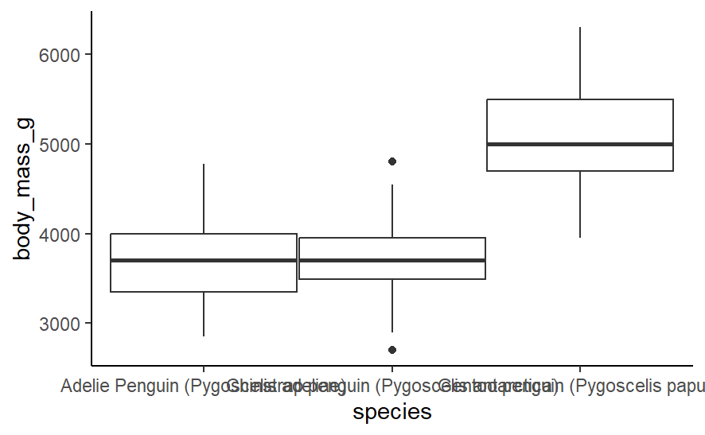

# 1. The Reproducibility Crisis - Do We Care?

### Reproducible experiments are experiments that can be repeated by someone else using the same data and same analysis to achieve the same results. Being reproducible means that practical data collection methods and the data obtained are available to others. Code that cleans data, performs statistical tests or creates figures for visual analysis should also be accessible. 
### The Reproducibility Crisis and its Causes:
### Over 70% of researchers cannot reproduce other scientists’ experiments, and 50% can’t reproduce their own results (Baker, 2016). Thus, scientists clearly don’t share detailed enough descriptions of their experimental methods (both practical and analytical) for others to follow their procedures correctly and reproduce their results. This is the reproducibility crisis.
### Potential reasons for this crisis can vary from selective reporting in articles, to other scientists lacking necessary technical skills to reproduce the results. Other reasons are as follows. People are protective of their work and don’t want to share it as they fear they won’t receive credit for their results, data and code. Making something reproducible is time consuming as each stage of the research must be described - this time could instead be spent trying to find funding. There is low desire to publish papers that reproduce and check other people’s experiments as the subject isn’t new – for example, only 24% of scientists questioned said they had managed to publish successful replications of other experiments, and only 13% had managed for failed replications. Finally, people don’t report to the authors when they fail to reproduce an experiment and instead believe they have done something wrong – reporting failed reproduction attempts may promote the author to improve reproducibility.
### Why care about being reproducible?
### So, reproducibility is lacking, and we should care about this as reproducibility benefits both the paper’s author(s) and other scientists. There are 3 main benefits.
### Firstly, experiments that are reproducible, provide access to data and / or are in open access journals may receive more funding as well as more citations or media coverage.
### Secondly, reproducibility can increase reliability of experiments. For example, we can see how data transforms into a figure so can tell if data has been manipulated and differs from the original data.
### Thirdly, the ability to share data, code and methods by being reproducible can reduce time wasting in the scientific community. This is firstly because you and others can repeat this experiment easily without needing to spend time remembering / redesigning experimental methods. Secondly, it prevents duplication of research and code writing when performing novel research. Code functions written for one experiment can be reused in the same or different future experiments, whilst shared data can be used in metadata studies to analyse large scale trends. 
### Reducing time wasting allows us to focus on performing novel research.  This is essential if we are to keep up with rapidly growing challenges such as rising food demand or combatting diseases. For example, scientific collaboration may have assisted the speedy formation of the COVID vaccine (CF, 2020).


# Question 2: A Figure Badly Showing How Body Mass Varies Between Different Penguin Species

```{r, echo = FALSE}
# I wrote my code for this figure in the file "bad_plot_code" and have saved the plot image as bad_figure.jpg in the subfolder "figures". I will now embed this figure below. 
```




### This figure correctly shows that Adelie and Chinstrap penguins have similar and smaller median body masses than Gentoo penguins – but that the interquartile ranges of all 3 are roughly similar. 
### However, the lack of grid lines makes interpretation difficult - theme_bw() should be used instead of theme_classic(). The lack of clear axes labels is also an issue. The labels of each species’ boxplot should be shortened so they don’t overlap and can be read. Change these titles using scale_x_discrete(labels = c()). Axes titles like body_mass_g would also look better if renamed “Body Mass (g)”, for example. 
### Each species’ boxplot should be coloured differently using geom_boxplot(aes(colour=species)) and there should be a corresponding legend for the colours by species. 
### To improve the data representation, all data points can be plotted over the boxplot. Using geom_jitter() helps prevent points overlapping, and the transparency (alpha) of the points can be altered as to highlight when points overlap. The width of these boxplots could also be reduced to prevent boxes touching as this may cause confusion when jittering points and is also unattractive. However, wider boxplots allow more jitter action so fewer points in each box overlap.

# Question 3: Discuss The Importance of Colour Choice for Communication in Science Figures and What Considerations Should Be Made

### Colour is important in data visualisation. It can reduce the complexity of a figure, make it more intuitive to understand and make it more engaging or attractive. 
### However, poor colour choices in figures can bias data perception and make patterns indistinguishable to colour blind people or when printed in greyscale. Some common colour maps and default colour settings used in some programs like rainbow gradients can cause these issues, being neither perceptually uniform nor easily read in greyscale. 
### To help increase accessibility, readability and reliability of coloured figures we should consider the following:
### 1. Perceptually uniform colour gradients. The amount of colour difference should be proportional to the change in data value shown. This means that the difference between datapoint values can be easily assessed. 
### 2. Colour gradients should use an intuitive colour order where lightness and brightness increase linearly. If colours aren’t ordered by lightness, false lightness gradients may be perceived. Intuitive colour order means colour maps can be understood without constant reference to the colour bar and may emphasise data trends. 
### 3. Colour blind friendliness. ~0.5% of women and 8% of men have colour vision deficiencies. By ensuring points 1 and 2, we can make sure that colour maps are readable to people with complete colour blindness or when printed greyscale. However, for partial colour blindness, like deuteranomaly which causes red-green dichromatism, avoiding using red and green of similar intensities is helpful. Different intensities means that even if red and green are used and both appear brown, they will appear different shades. Models like CIECAM02-UCS help us find and create perceptually uniform colour maps with colours suitable for different colour vision deficiencies. 
### 4. The visual attractiveness of colours. Some warmer colours like yellow are more eye-catching than cooler colours like green as two thirds of cone cells perceive longer wavelengths of light. Eye-catching colours should only be used to accentuate very important data points and should otherwise be avoided to prevent visual bias. 
### 5. The colour map type depends on the data type. Whether a sequential, divergent, multi-sequential or cyclic colour map is used depends on whether the data has an order; has a central value (eg. 0); its order relative to this central value (eg. increasing as you move away from this central value). With a central value of 0, a divergent or multi-sequential map would use a different colour above and below 0 to facilitate rapid differentiation between positive and negative values.  
### 6. The graph type. Some graph types, like heat map colour tiles with no gaps between tiles, can locally distort colour perception as colours directly next to each other influence each other’s appearance. 
### 7. A colour bar showing the colour scale should always be included and should not be stretched or compressed as this may alter the appearance of the colour scale. 
### 8. The graph background colour should contrast the colour of the points to make the points stand out eg. use a light background for a dark colour map scheme. 


# Question 4: Performing a Linear Regression of Penguin Flipper Length by Body Mass and Plotting this as a Figure:

## Url to my GitHub repository: https://github.com/Calathea007/final_penguins_assignment 

## First, set the working directory:

```{r, results = FALSE}
#Set your working directory here and check it is correct.
setwd()
getwd()
```

## Install and download the penguin data set and appropriate packages:

```{r, message = FALSE}
source("functions/library.R")
```

### First, assess the penguins data to see if it requires cleaning

```{r}
head(penguins_raw)
```

### So, this data set has column names with spaces and capitals. So, we must clean it to remove these so that we can specify the columns we want in the figure easily.

### But, first we must save the raw, un-edited data
```{r}
write.csv(penguins_raw, paste0("data_raw/penguins_raw.csv"))
```

## Now, cleaning the dataset:

### I have made various cleaning functions and saved them separately in an R script file called cleaning so I must source it in to apply it to the data.
```{r}
source("functions/cleaning.R")
```

### Now to use the sourced cleaning function to make a clean dataset called penguins_clean. Check afterwards that it is clean using the names() and head() functions.

```{r}
penguins_clean <- cleaning(penguins_raw)
names(penguins_clean)
write.csv(penguins_clean, paste0("data_clean/penguins_clean.csv"))
head(penguins_clean)
```

### So, we have already loaded and cleaned our dataset. So, now let's do a linear regression of bodymass and flipper length to see if there is a relationship between the two. 

## Performing a linear regression:

```{r}
flipper_regression <- lm(formula = flipper_length_mm ~ body_mass_g, data = penguins_clean)
```

## Analysing the significance of our linear regression model:

```{r}
summary(flipper_regression)
```

```{r, echo = FALSE, results = FALSE}
anova(flipper_regression)
```


### The P-value for the F-statistic is much less than 0.05. This shows that our model is statistically significant and that flipper length changes significantly with changes in body mass.
### The R-squared value shows that 76% of the variation in y (flipper length) is explained by variation in x (body mass).
### The Pr values in our coefficient table tell us that both the intercept and slope are significantly different from 0. 
### Our slope is positive and shows that flipper length increases with increasing body mass. 

### So, our model is significant. But, before we plot this regression we must check that this model fits the assumptions of a regression using diagnostic plots. 

## Testing assumptions:

### I will test 2 assumptions (a) and (b)

### (a) - Testing if our data is normally distributed using a Normal Q-Q plot. 

```{r}
plot(flipper_regression, which = 2)
```

### This plot shows that our data fits well with the assumption of normally distributed residuals as our points fall in an almost completely straight line. This straight line falls almost exaclty on the dotted line we expect under a normal distribution. At each x value, our possible Y values (residuals) are thus approximately normally distributed. 

### (b) - Testing for equal variance of y values across all x values

```{r}
plot(flipper_regression, which =1)
```

### Our data fit the assumption of equal variance well. We can see this as the red line showing mean residual value falls close to the line where residuals are 0. Also, there is an equal spread of points above and below the line and there is no trend in how close residuals are to 0 as we go from left to right (there is no funnel effect). There are also no key outliers.

## Plotting our regression:

### So, our model is significant and our data fits the assumptions so we can now make the figure.

### I have made a regression plotting function which I have saved separately in a plotting file which I will now source in. 

```{r}
source("functions/plotting.R")
```

### This function uses a colour blind friendly palette with differently coloured and shaped points for each species to show that the regression trend is maintained within each species.

```{r, warning = FALSE, message=FALSE}
flipper_mass_regression_plot <- plot_regression_figure(penguins_clean)
flipper_mass_regression_plot
```


### So we have created our figure. Now we must save it as an svg of the correct size and scaling. I will save to svg rather than png as it saves as a vector so that the image does not become pixellated if one tries to zoom in on the figure. 

## Saving our image as an svg:

### I have sourced my svg saving code.
```{r, message = FALSE, warning = FALSE, results = FALSE}
source("functions/saving_figures.R")
save_regression_plot_svg(penguins_clean, 'figures/regression_fig01_vector.svg',
                         size = 20, scaling = 1.1) 
```

# Question 5: Analysing someone else's code

### **Other student's url: https://github.com/Diplodocus123/PalmerPenguinAssignment**

### I have not included headings in **bold** in my word count! 

## **What elements of your partner's code helped you to understand their data pipeline?**

### At the very start of their code they explained what they were testing and which statistical test they were going to use – this provides structure to the pipeline. Throughout the document they explained each step of code clearly eg. explaining what each line of cleaning code did. 

## **Did you try to run it? Did it work?**

### The code didn’t run. I didn’t have the “car” package installed so library(car) didn’t work – but this was easily solved. Their source() functions used absolute file paths rather than relative file paths. This meant it wasn’t reproducible on my laptop. I had to remove the first part of file paths “C:/Users...” for all source functions to reach a relative path (“Functions/Libraries.R”). 
### This student performed setwd() using absolute file paths not just in their main Rmd, but also in the Cleaning.R file. This is unnecessary as Cleaning.R is in the same working directory and meant that when I tried to source the code it failed and I had to go to the Cleaning.R file directly and change the working directory there too. 
### Their code for writing a csv didn’t work as it lacked paste0(). The code should be: write.csv(data, paste0(“relative path”)). 

## **What suggestions would you make for improving their code to make it more understandable or reproducible, and why?** 

### I would remove all duplication. Duplication makes code long, difficult to understand and means you may edit one duplicate but forget to edit the other which may cause issues. Code for loading libraries and cleaning data was duplicated. library(ggplot2) was called when plotting their figure even though they sourced ggplot2 in Libraries.R higher up. Some cleaning functions appeared in the main Cleaning.R file and other cleaning files like BodyMassSex.R or SubsetData.R. 
### Splitting code into smaller chunks so that output appears clearly, directly below the chunk that coded it, rather than after a long piece of code (not all of which is relevant to that output), would make the code clearer. 
### An explanation for the inclusion of the histogram of residuals would also be useful, as currently its purpose might be unclear. 

## **If you needed to alter your partner's figure using their code, do you think that would be easy or difficult, and why?**

### It would be easy to edit their code, although I would prefer this plotting code to be saved as a function in a separate R file in the directory so I could apply this plotting code to different data at a later point. 

## **Reflect on your own code and figure from Question 4 with reference to your partner's work and also their review of yours.**

## **What improvements did they suggest, and do you agree?**

### They suggested explaining each step of my cleaning function in more detail and I agree. I only mentioned cleaning column headings of spaces and capital letters despite also removing NAs and columns comment and delta. In retrospect, I would further their comment by saying I should add a description above each function I created for plotting, library loading, figure saving and cleaning within their separate files as descriptions are helpful for reproducibility. I have done neither of these edits as I wasn't sure we were allowed to edit based on reviews.    

## **What did you learn about writing code for other people?**

### It is harder than you think as you must remember to write comments for every step you perform so that it is reproducible. It is also easy to make small mistakes in directory and file path names that make it difficult to run code on someone else’s laptop.
